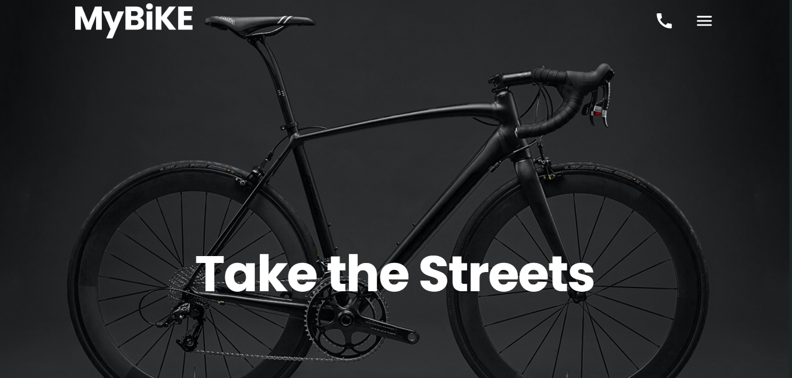

# My Bike Landing

A responsive landing page for a bike shop, built based on a Figma design.  
The project focuses on clean layout, smooth interactions, and performance optimization.

---

## Live Preview

[Demo](https://horbenkoOleksandr.github.io/my-bike/)

---

## About the Project

This project is a responsive landing page created to practice modern frontend development skills and pixel-perfect layout implementation based on a Figma design.

The main goal was to accurately reproduce the design across different screen sizes while maintaining clean code structure, smooth user experience, and good performance.


## Design Reference
[Figma Design](https://www.figma.com/design/NZQAIydtHo5QkINyGLHNcq/BIKE-New-Version)

---

## Features
- Fully responsive layout (mobile / tablet / desktop)
- Pixel-perfect implementation based on Figma
- Smooth scrolling navigation
- Interactive UI elements (menu, hover effects)
- Structured SCSS architecture (BEM methodology)

---

## Challenges
As this was my first experience with creating a comprehensive landing page, several challenges emerged throughout the development process. One notable challenge was implementing a fully responsive design that accurately reflects the Figma mockups.

Key Challenges:
1. Responsive layout implementation: Ensuring that the layout matched the Figma design required careful work with grid systems and media queries.
2. Background image scaling without layout issues: Implementing hover effects (like zoom) without causing horizontal scroll required using pseudo-elements and overflow control.
3. Mobile menu behavior: Creating a smooth and user-friendly navigation menu using CSS and JavaScript.

---
 
## Technologies Used
- HTML5
- SCSS (Sass)
- JavaScript (ES6)
- Gulp
- Stylelint

---

## Getting Started

### Clone the repository
```bash
git clone https://github.com/horbenkoOleksandr/my-bike.git
cd my-bike

Install dependencies
npm install

Run project
npm start

Design Sizes:
-Desktop: 1280px
-Tablet: 640px
-Mobile: 320px+
